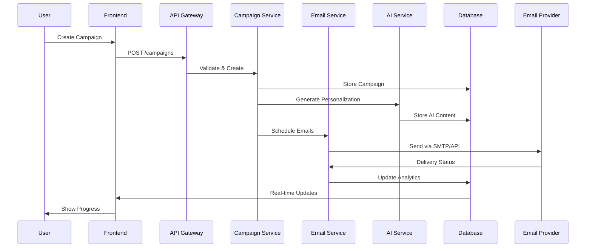
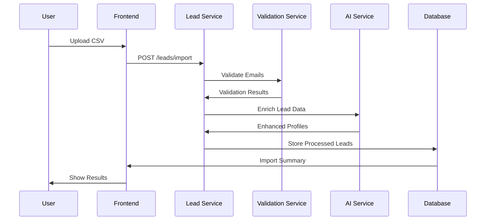

# 🏗️ Reachly System Architecture

## 🎯 Architecture Overview

Reachly follows a modern **microservices-inspired architecture** with clear separation of concerns, designed for scalability and maintainability while keeping costs minimal through strategic use of free-tier services.

## 📊 High-Level Architecture Diagram

The system architecture consists of six main layers:

1. **Frontend Layer** - User interface and client-side logic
2. **API Gateway Layer** - Request routing, authentication, and middleware
3. **Core Services Layer** - Business logic microservices
4. **External Integration Layer** - Third-party API integrations
5. **Data Layer** - Database and caching solutions
6. **Infrastructure Layer** - Hosting, monitoring, and deployment

## 🔄 Data Flow Architecture

### Email Campaign Flow


### Lead Import & Processing Flow


## 🏛️ Service Architecture

### Frontend Architecture (Next.js)
```typescript
src/
├── app/                    # Next.js App Router
│   ├── (auth)/            # Authentication routes
│   ├── dashboard/         # Main application
│   ├── campaigns/         # Campaign management
│   ├── leads/            # Lead management
│   ├── analytics/        # Analytics dashboard
│   └── settings/         # User settings
├── components/           # Reusable UI components
│   ├── ui/              # Base UI components
│   ├── forms/           # Form components
│   ├── charts/          # Analytics components
│   └── email/           # Email-specific components
├── lib/                 # Utility functions
│   ├── api.ts          # API client
│   ├── auth.ts         # Authentication logic
│   ├── utils.ts        # General utilities
│   └── validations.ts  # Form validation schemas
└── hooks/              # Custom React hooks
    ├── useAuth.ts      # Authentication hook
    ├── useCampaigns.ts # Campaign management
    └── useAnalytics.ts # Analytics hook
```

### Backend Architecture (Node.js/Express)
```typescript
src/
├── controllers/        # Request handlers
│   ├── auth.controller.js
│   ├── user.controller.js
│   ├── campaign.controller.js
│   ├── email.controller.js
│   ├── lead.controller.js
│   └── analytics.controller.js
├── services/          # Business logic
│   ├── emailService.js
│   ├── campaignService.js
│   ├── leadService.js
│   ├── aiService.js
│   └── analyticsService.js
├── models/           # Database models (Prisma)
│   ├── User.js
│   ├── Campaign.js
│   ├── Email.js
│   ├── Lead.js
│   └── Analytics.js
├── middleware/       # Express middleware
│   ├── auth.js
│   ├── rateLimiter.js
│   ├── validation.js
│   └── errorHandler.js
├── routes/          # API routes
│   ├── auth.routes.js
│   ├── campaign.routes.js
│   ├── email.routes.js
│   └── analytics.routes.js
├── utils/           # Utility functions
│   ├── email.utils.js
│   ├── crypto.utils.js
│   └── validation.utils.js
└── config/         # Configuration files
    ├── database.js
    ├── email.js
    └── ai.js
```

## 🗄️ Database Architecture

### PostgreSQL Schema Design
```sql
-- Core Tables
Users (
  id UUID PRIMARY KEY,
  email VARCHAR UNIQUE,
  password_hash VARCHAR,
  organization_id UUID,
  created_at TIMESTAMP,
  updated_at TIMESTAMP
)

Organizations (
  id UUID PRIMARY KEY,
  name VARCHAR,
  domain VARCHAR,
  plan_type VARCHAR,
  created_at TIMESTAMP
)

Email_Accounts (
  id UUID PRIMARY KEY,
  user_id UUID REFERENCES Users(id),
  provider VARCHAR, -- 'gmail', 'outlook', 'smtp'
  email_address VARCHAR,
  access_token TEXT,
  refresh_token TEXT,
  smtp_config JSONB,
  is_active BOOLEAN DEFAULT true
)

Campaigns (
  id UUID PRIMARY KEY,
  user_id UUID REFERENCES Users(id),
  name VARCHAR,
  subject_template TEXT,
  email_template TEXT,
  status VARCHAR, -- 'draft', 'active', 'paused', 'completed'
  send_schedule JSONB,
  created_at TIMESTAMP
)

Leads (
  id UUID PRIMARY KEY,
  campaign_id UUID REFERENCES Campaigns(id),
  email VARCHAR,
  first_name VARCHAR,
  last_name VARCHAR,
  company VARCHAR,
  position VARCHAR,
  custom_fields JSONB,
  status VARCHAR, -- 'pending', 'sent', 'replied', 'bounced'
  created_at TIMESTAMP
)

Email_Sequences (
  id UUID PRIMARY KEY,
  campaign_id UUID REFERENCES Campaigns(id),
  sequence_number INTEGER,
  delay_days INTEGER,
  subject_template TEXT,
  email_template TEXT,
  is_active BOOLEAN DEFAULT true
)

Email_Sends (
  id UUID PRIMARY KEY,
  lead_id UUID REFERENCES Leads(id),
  email_account_id UUID REFERENCES Email_Accounts(id),
  sequence_id UUID REFERENCES Email_Sequences(id),
  sent_at TIMESTAMP,
  opened_at TIMESTAMP,
  clicked_at TIMESTAMP,
  replied_at TIMESTAMP,
  bounced_at TIMESTAMP,
  message_id VARCHAR,
  status VARCHAR
)

Analytics_Events (
  id UUID PRIMARY KEY,
  campaign_id UUID REFERENCES Campaigns(id),
  lead_id UUID REFERENCES Leads(id),
  event_type VARCHAR, -- 'sent', 'opened', 'clicked', 'replied', 'bounced'
  event_data JSONB,
  created_at TIMESTAMP
)
```

### Redis Caching Strategy
```typescript
// Cache Keys Structure
const CACHE_KEYS = {
  user: (userId: string) => `user:${userId}`,
  campaign: (campaignId: string) => `campaign:${campaignId}`,
  analytics: (campaignId: string) => `analytics:${campaignId}`,
  emailQueue: 'email:queue',
  rateLimits: (userId: string) => `ratelimit:${userId}`,
  emailVerification: (email: string) => `verification:${email}`
};

// Cache Durations
const CACHE_TTL = {
  user: 3600,        // 1 hour
  campaign: 1800,    // 30 minutes  
  analytics: 300,    // 5 minutes
  verification: 86400 // 24 hours
};
```

## 🔌 API Architecture

### RESTful API Design
```typescript
// Authentication Endpoints
POST   /api/auth/login
POST   /api/auth/register
POST   /api/auth/logout
GET    /api/auth/me
POST   /api/auth/refresh

// User Management
GET    /api/users/profile
PUT    /api/users/profile
DELETE /api/users/account
GET    /api/users/usage

// Email Account Management
GET    /api/email-accounts
POST   /api/email-accounts/connect/gmail
POST   /api/email-accounts/connect/outlook
POST   /api/email-accounts/connect/smtp
DELETE /api/email-accounts/:id
PUT    /api/email-accounts/:id/toggle

// Campaign Management
GET    /api/campaigns
POST   /api/campaigns
GET    /api/campaigns/:id
PUT    /api/campaigns/:id
DELETE /api/campaigns/:id
POST   /api/campaigns/:id/start
POST   /api/campaigns/:id/pause
POST   /api/campaigns/:id/clone

// Lead Management
GET    /api/leads
POST   /api/leads/import
GET    /api/leads/:id
PUT    /api/leads/:id
DELETE /api/leads/:id
POST   /api/leads/verify-emails

// Email Sequences
GET    /api/campaigns/:id/sequences
POST   /api/campaigns/:id/sequences
PUT    /api/sequences/:id
DELETE /api/sequences/:id

// Analytics
GET    /api/analytics/campaigns/:id
GET    /api/analytics/overview
GET    /api/analytics/exports/:id
```

### WebSocket Real-time Updates
```typescript
// Socket Events
const SOCKET_EVENTS = {
  // Campaign events
  CAMPAIGN_STARTED: 'campaign:started',
  CAMPAIGN_PAUSED: 'campaign:paused',
  EMAIL_SENT: 'email:sent',
  EMAIL_OPENED: 'email:opened',
  EMAIL_CLICKED: 'email:clicked',
  EMAIL_REPLIED: 'email:replied',
  EMAIL_BOUNCED: 'email:bounced',
  
  // System events
  QUOTA_WARNING: 'quota:warning',
  DELIVERABILITY_ALERT: 'deliverability:alert'
};
```

## 🚀 Deployment Architecture

### Production Infrastructure
```yaml
# Vercel (Frontend)
Frontend Hosting:
  - Global CDN distribution
  - Automatic SSL certificates
  - Preview deployments
  - Edge functions for API routes

# Railway (Backend)
Backend Hosting:
  - Docker container deployment
  - Automatic deployments from Git
  - Built-in PostgreSQL database
  - Environment variable management
  - Health check monitoring

# Upstash (Redis)
Cache Layer:
  - Serverless Redis hosting
  - Global edge locations
  - REST API access
  - Automatic scaling
```

### CI/CD Pipeline
```yaml
# GitHub Actions Workflow
name: Deploy Reachly
on:
  push:
    branches: [main, develop]

jobs:
  test:
    runs-on: ubuntu-latest
    steps:
      - Checkout code
      - Run unit tests
      - Run integration tests
      - Code quality checks
      
  build-frontend:
    needs: test
    runs-on: ubuntu-latest
    steps:
      - Build Next.js application
      - Deploy to Vercel
      - Run E2E tests
      
  build-backend:
    needs: test
    runs-on: ubuntu-latest
    steps:
      - Build Docker image
      - Deploy to Railway
      - Run API tests
      - Update database schema
```

## 🔒 Security Architecture

### Authentication & Authorization
```typescript
// JWT Token Structure
interface JWTPayload {
  userId: string;
  organizationId: string;
  email: string;
  role: 'admin' | 'user' | 'viewer';
  permissions: string[];
  iat: number;
  exp: number;
}

// Permission System
const PERMISSIONS = {
  CAMPAIGNS_READ: 'campaigns:read',
  CAMPAIGNS_WRITE: 'campaigns:write',
  LEADS_IMPORT: 'leads:import',
  ANALYTICS_VIEW: 'analytics:view',
  ORGANIZATION_ADMIN: 'org:admin'
};
```

### Data Encryption
```typescript
// Encryption Strategy
const ENCRYPTION = {
  // At Rest
  database: 'AES-256 encryption',
  emailTokens: 'AES-256-GCM',
  passwords: 'bcrypt with salt rounds: 12',
  
  // In Transit
  api: 'TLS 1.3',
  websockets: 'WSS (WebSocket Secure)',
  
  // Application Level
  sensitiveFields: ['access_token', 'refresh_token', 'smtp_password']
};
```

## 📊 Monitoring & Observability

### Application Monitoring
```typescript
// Metrics Collection
const METRICS = {
  // Performance
  apiResponseTime: 'histogram',
  databaseQueryTime: 'histogram',
  emailSendRate: 'counter',
  
  // Business
  campaignsActive: 'gauge',
  emailsPerHour: 'counter',
  deliverabilityRate: 'gauge',
  
  // System
  memoryUsage: 'gauge',
  cpuUtilization: 'gauge',
  errorRate: 'counter'
};
```

### Alerting Strategy
```yaml
Critical Alerts:
  - API response time > 5 seconds
  - Error rate > 5%
  - Database connection failures
  - Email deliverability < 90%

Warning Alerts:
  - API response time > 2 seconds
  - Memory usage > 80%
  - Email queue backlog > 1000
  - User signup rate spike
```

## 🔄 Scalability Considerations

### Horizontal Scaling Strategy
```typescript
// Microservices Breakdown (Future)
const SERVICES = {
  userService: 'User management and authentication',
  campaignService: 'Campaign creation and management',
  emailService: 'Email sending and tracking',
  analyticsService: 'Data processing and reporting',
  aiService: 'Personalization and content generation',
  leadService: 'Lead management and verification'
};

// Load Balancing
const LOAD_BALANCING = {
  frontend: 'Vercel Edge Network',
  backend: 'Railway automatic load balancing',
  database: 'PostgreSQL connection pooling',
  cache: 'Redis Cluster (future scaling)'
};
```

---

*This architecture ensures Reachly can start small with minimal costs while maintaining the flexibility to scale to enterprise-level usage as the platform grows.*